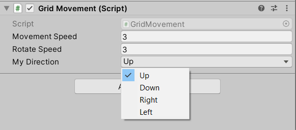

# unity-cardinal-direction
### A convenient representation of direction that only accepts 4 values: up, down, left, and right

Useful in grid-based games, to keep code logic clear and prevent invalid values from sneaking in (I'm looking at you, Vector2).

Comes with operator overloading support. 

## Example

```
public CardinalDirection2D direction;
```
This allows you to select a direction using an enum in the inspector.



Which can then be used in operations like a regular vector.
```
transform.position += direction;
```
or:
```
transform.position += CardinalDirection2D.right;
```

## Features

#### Find adjacent directions
```
CardinalDirection2D direction = CardinalDirection2D.up;
var right = direction.RotateClockwise;
var left = direction.RotateAntiClockwise;
var down = direction.Opposite;
```
#### Return Quaternions for simple rotations around the z-axis, facing the given direction.
```
transform.rotation = CardinalDirection2D.right.AsRotation;
```

#### Find the nearest cardinal direction from an arbitrary Vector2
```
CardinalDirection2D closestDirection = CardinalDirection.RoundedFromVector(new Vector2(4,5));
```

#### Return vectors from math operations on directions
```
Vector2 product = direction * 4.3f;
Vector2Int sum = direction + 2 * anotherDirection;
```

## Credits

Placeholder image by Kingshemboo on OpenGameArt - https://opengameart.org/content/sci-fi-hover-tank
